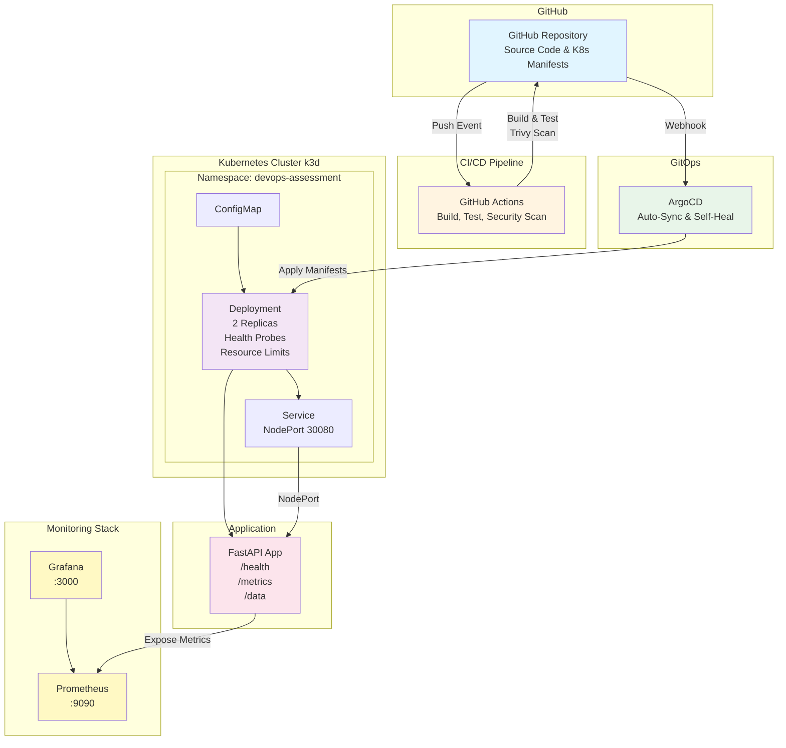

# DevOps Assessment - Complete Infrastructure Solution

A production-ready FastAPI application demonstrating modern DevOps practices including containerization, Kubernetes orchestration, CI/CD, GitOps, monitoring, and security scanning.

## 🏗️ Architecture



## 🚀 Quick Start

### Prerequisites

- Docker & Docker Compose
- k3d (Kubernetes in Docker)
- kubectl
- Git
- Trivy (optional, for security scanning)

### Installation

```bash
# Clone repository
git clone https://github.com/YOUR-USERNAME/devops-assessment.git
cd devops-assessment

# Run locally with Docker Compose
docker-compose up --build

# OR deploy to Kubernetes
./scripts/deploy.sh
```

## 📋 Features

- ✅ FastAPI REST API with health checks
- ✅ Multi-stage Docker builds
- ✅ Kubernetes deployment with probes
- ✅ CI/CD pipeline (GitHub Actions)
- ✅ GitOps with ArgoCD
- ✅ Security scanning with Trivy
- ✅ Prometheus metrics
- ✅ Grafana dashboards
- ✅ Automated testing
- ✅ Comprehensive documentation

## 🛠️ Local Development

### Run with Docker

```bash
# Build image
docker build -t devops-assessment:latest .

# Run container
docker run -p 8000:8000 devops-assessment:latest

# Access application
curl http://localhost:8000/health
```

### Run with Docker Compose

```bash
# Start all services
docker-compose up -d

# Check logs
docker-compose logs -f

# Stop services
docker-compose down
```

### Run Tests

```bash
# Install dependencies
pip install -r requirements.txt

# Run tests
./scripts/test.sh
```

## ☸️ Kubernetes Deployment

### Setup k3d Cluster

```bash
# Create cluster
k3d cluster create devops-cluster

# Verify cluster
kubectl cluster-info
```

### Deploy Application

```bash
# Use automated script
./scripts/deploy.sh latest

# Or manual deployment
kubectl apply -f k8s/

# Check deployment status
kubectl get all -n devops-assessment
```

### Access Application

```bash
# Via NodePort
curl http://localhost:30080/health

# Port forward
kubectl port-forward -n devops-assessment svc/devops-app-service 8000:80
curl http://localhost:8000/health
```

## 📊 Monitoring

### Start Monitoring Stack

```bash
docker-compose -f monitoring/docker-compose.monitoring.yml up -d
```

### Access Dashboards

- **Prometheus**: http://localhost:9090
- **Grafana**: http://localhost:3000 (admin/admin)

### Available Metrics

- `http_requests_total` - Total HTTP requests
- `http_request_duration_seconds` - Request latency
- `http_requests_in_progress` - Active requests

## 🔒 Security Scanning

```bash
# Scan Docker image
trivy image devops-assessment:latest

# Scan Kubernetes configs
trivy config k8s/

# Run via script (if you create scripts/scan-security.sh)
./scripts/scan-security.sh
```

## 🔄 GitOps with ArgoCD

### Install ArgoCD

```bash
# See detailed instructions
cat argocd/README.md
```

### Deploy Application via ArgoCD

```bash
kubectl apply -f argocd/application.yaml
```

## 🧪 API Endpoints

| Endpoint | Method | Description |
|----------|--------|-------------|
| `/health` | GET | Health check |
| `/data` | GET | Retrieve all data |
| `/data` | POST | Create new data |
| `/metrics` | GET | Prometheus metrics |
| `/docs` | GET | API documentation |

## 📁 Project Structure

```
devops-assessment/
├── README.md                          # Comprehensive documentation
├── .gitignore                         # Python, Docker, IDE files
├── Dockerfile                         # Multi-stage FastAPI container
├── .dockerignore                      # Build optimization
├── docker-compose.yml                 # Local development stack
├── requirements.txt                   # Python dependencies
│
├── src/                               # Application code
│   ├── app.py                         # FastAPI application
│   └── tests/
│       ├── test_api.py                # API tests
│       └── test_health.py             # Health check tests
│
├── k8s/                               # Kubernetes manifests
│   ├── namespace.yaml                 # Namespace definition
│   ├── deployment.yaml                # Application deployment
│   ├── service.yaml                   # NodePort service
│   └── configmap.yaml                 # Non-sensitive config
│
├── argocd/                            # GitOps configuration
│   ├── application.yaml               # ArgoCD Application CRD
│   └── README.md                      # ArgoCD setup instructions
│
├── monitoring/                        # Observability stack
│   ├── prometheus/
│   │   └── prometheus.yml             # Prometheus config
│   ├── grafana/
│   │   └── datasource.yml             # Prometheus datasource
│   └── docker-compose.monitoring.yml  # Monitoring stack
│
├── scripts/                           # Automation scripts
│   ├── deploy.sh                      # Main deployment script
│   └── test.sh                        # Run tests
│
└── .github/                           # CI/CD pipeline
    └── workflows/
        └── ci.yml                     # GitHub Actions workflow
```

## 🔧 Configuration

### Environment Variables

- `LOG_LEVEL` - Logging level (default: info)
- `ENVIRONMENT` - Environment name (default: development)

### Kubernetes Resources

- **CPU Request**: 100m
- **CPU Limit**: 200m
- **Memory Request**: 128Mi
- **Memory Limit**: 256Mi

## 🐛 Troubleshooting

### Common Issues

**1. Pod not starting**
```bash
kubectl describe pod -n devops-assessment
kubectl logs -n devops-assessment -l app=devops-app
```

**2. Image pull issues**
```bash
# Re-import image to k3d
k3d image import devops-assessment:latest -c devops-cluster
```

**3. Service not accessible**
```bash
# Check service
kubectl get svc -n devops-assessment

# Port forward directly
kubectl port-forward -n devops-assessment deployment/devops-app 8000:8000
```

## 🎯 Design Decisions

### Why FastAPI?
- Modern Python framework
- Built-in async support
- Automatic API documentation
- Easy Prometheus integration

### Why k3d?
- Lightweight Kubernetes
- Fast startup
- No cloud costs
- Ideal for local development

### Why ArgoCD?
- GitOps best practices
- Declarative deployment
- Auto-sync capabilities
- Industry standard

### Why Multi-Stage Docker Build?
- Smaller final image
- Build cache optimization
- Security (no build tools in production)

## 📝 License

This project is for assessment purposes.

## 👤 Author

Jaroslav Hrazdera
- Portfolio: https://jaroslav.tech
- GitHub: [@jardahrazdera](https://github.com/jardahrazdera)
- LinkedIn: [jaroslavhrazdera](https://linkedin.com/in/jaroslavhrazdera)
