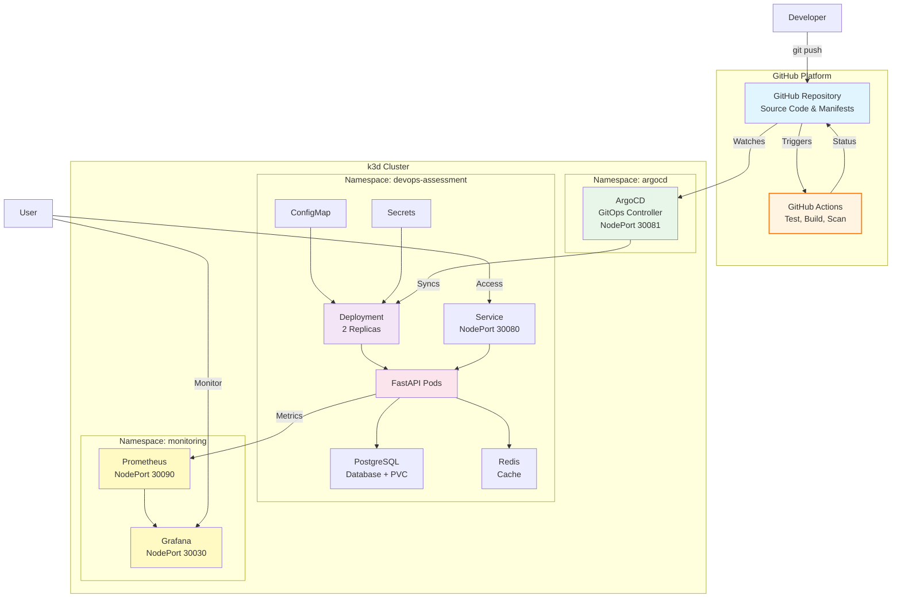

# DevOps Assessment - Complete Infrastructure Solution

A production-ready FastAPI application demonstrating modern DevOps practices including containerization, Kubernetes orchestration, CI/CD, GitOps, monitoring, and security scanning.

## 🏗️ Architecture

This project offers **two deployment options**:

### Option 1: Docker Compose (Quick Local Development)

Fast iteration for development with Docker Compose:

- FastAPI application
- PostgreSQL database + Redis caching
- Environment-based secrets (.env file)
- Optional: Prometheus + Grafana monitoring (separate compose file)

### Option 2: Kubernetes (Full Production-like Environment)

Complete integrated stack in k3d cluster:

- Application with health probes and resource limits
- PostgreSQL database with persistent storage (PVC)
- Redis caching
- Kubernetes Secrets for credentials
- Prometheus monitoring
- Grafana dashboards
- ArgoCD for GitOps
- Everything in Kubernetes

*(Note: Helm charts are also available in `charts/` for advanced users, but the default deployment uses raw manifests for clarity.)*

---

## 🎯 Kubernetes Architecture (Recommended)



### Deploy Everything with One Command

```bash
./scripts/deploy.sh
```

This deploys:

- **k3d cluster** (with NodePort mappings)
- **PostgreSQL** (persistent database with PVC)
- **Redis** (caching layer)
- **Application** (2 replicas, health probes, resource limits)
- **Secrets** (Kubernetes Secrets for credentials)
- **Prometheus** (metrics collection)
- **Grafana** (visualization dashboards)

### Access URLs

| Service | URL | Credentials |
|---------|-----|-------------|
| Application | <http://localhost:30080/health> | - |
| API Docs | <http://localhost:30080/docs> | - |
| Prometheus | <http://localhost:30090> | - |
| Grafana | <http://localhost:30030> | admin/admin |
| ArgoCD UI | <http://localhost:30081> | admin / (see below) |

**ArgoCD Password:** `kubectl -n argocd get secret argocd-initial-admin-secret -o jsonpath='{.data.password}' | base64 -d`

### Deploy with ArgoCD for GitOps

**Option 1: Automated (Recommended)**

```bash
./scripts/deploy.sh --argocd
```

This automatically installs ArgoCD, configures the application, and enables GitOps deployment.

**Option 2: Manual Installation**

```bash
# Install ArgoCD
kubectl create namespace argocd
kubectl apply -n argocd -f https://raw.githubusercontent.com/argoproj/argo-cd/stable/manifests/install.yaml

# Deploy via ArgoCD
kubectl apply -f argocd/application.yaml
```

**ArgoCD provides:**

- Automated Git-to-cluster sync
- Self-healing (reverts manual changes)
- Declarative deployments

---

## 📦 Docker Compose (Alternative for Local Dev)

For quick local testing without Kubernetes:

```bash
# Copy environment template
cp .env.example .env

# Edit .env with your credentials (file is gitignored)
# Then start services
docker-compose up -d

# Optional: Start monitoring
docker-compose -f monitoring/docker-compose.monitoring.yml up -d
```

**Access:**

- App: <http://localhost:8000>
- Prometheus: <http://localhost:9090>
- Grafana: <http://localhost:3000>

**Note:** The `.env` file contains database credentials and is gitignored. Use `.env.example` as a template.

---

## 🚀 Quick Start

### Prerequisites

- Docker & Docker Compose
- k3d (Kubernetes in Docker)
- kubectl
- envsubst (gettext package - for secret generation)
- Git
- Trivy (optional, for security scanning)

### Installation

```bash
# Clone repository
git clone https://github.com/jardahrazdera/devops-assessment.git
cd devops-assessment

# Run locally with Docker Compose
docker-compose up --build

# OR deploy to Kubernetes
./scripts/deploy.sh
```

## 📋 Features

- ✅ FastAPI REST API with health checks
- ✅ PostgreSQL database with persistent storage
- ✅ Redis caching (60s TTL, cache-aside pattern)
- ✅ Multi-stage Docker builds
- ✅ Kubernetes deployment with probes
- ✅ Pod Disruption Budget for high availability
- ✅ Secret management (K8s Secrets + .env files)
- ✅ CI/CD pipeline (GitHub Actions)
- ✅ GitOps with ArgoCD
- ✅ Security scanning with Trivy
- ✅ Prometheus metrics
- ✅ Grafana dashboards
- ✅ Automated testing
- ✅ JSON structured logging with request tracing
- ✅ Comprehensive documentation
- ✅ **Helm Templates included** (in `charts/` directory)

## 🔄 CI/CD Pipeline

The project includes a GitHub Actions workflow (`.github/workflows/ci.yml`) that automates:

1. **Testing** - Runs pytest with coverage on every push
2. **Building** - Creates Docker image with commit SHA tagging
3. **Security Scanning** - Runs Trivy vulnerability scanner
4. **Deployment** - Simulated (see note below)

### ⚠️ Important Note: Deployment Simulation

The GitHub Actions pipeline **simulates** deployment rather than performing actual Kubernetes deployment because:

- **Local-only environment** - This assessment runs on k3d (local Kubernetes), not a public cluster
- **No registry access** - GitHub Actions cannot push to your local Docker daemon
- **Credential requirements** - Pushing to public registries (GHCR/DockerHub) requires transferable credentials
- **GitOps architecture** - ArgoCD handles actual deployment by watching the repository

### How to Deploy Locally

For actual deployment to your local k3d cluster, use:

```bash
./scripts/deploy.sh --argocd
```

### Production CI/CD Workflow

In a real production environment, the GitHub Actions pipeline would:

1. Push Docker image to container registry (GHCR/ECR/DockerHub) with commit SHA tag
2. Update `k8s/deployment.yaml` with new image reference
3. Commit the manifest change back to the repository
4. ArgoCD automatically detects the change and syncs to cluster

This maintains GitOps principles where Git is the single source of truth.

## 🛠️ Local Development

### Run with Docker

```bash
# Build image
docker build -t devops-assessment:latest .

# Run container
docker run -p 8000:8000 devops-assessment:latest

# Access application
curl http://localhost:8000/health
```

### Run with Docker Compose

```bash
# Start all services
docker-compose up -d

# Check logs
docker-compose logs -f

# Stop services
docker-compose down
```

### Run Tests

```bash
# Install dependencies
pip install -r requirements.txt

# Run tests
./scripts/test.sh
```

## ☸️ Kubernetes Deployment

### Setup k3d Cluster

```bash
# Create cluster
k3d cluster create devops-cluster

# Verify cluster
kubectl cluster-info
```

### Deploy Application

**Recommended: Automated Script**

```bash
./scripts/deploy.sh
```

**Alternative: Manual Deployment**

If you prefer to deploy manually, you must generate secrets and apply all manifests (including monitoring) in order:

```bash
# 1. Generate secrets from templates
# (Ensure POSTGRES_USER, POSTGRES_PASSWORD, POSTGRES_DB are set, or defaults will be used)
export POSTGRES_USER=${POSTGRES_USER:-devops}
export POSTGRES_PASSWORD=${POSTGRES_PASSWORD:-devops123}
export POSTGRES_DB=${POSTGRES_DB:-devopsdb}

envsubst < k8s/postgres-secret.yaml.template > k8s/postgres-secret.yaml
envsubst < k8s/app-secret.yaml.template > k8s/app-secret.yaml

# 2. Deploy Application Stack (App, DB, Redis)
kubectl apply -f k8s/

# 3. Deploy Monitoring Stack (Prometheus, Grafana)
# Important: Applies RBAC, ConfigMaps, and Deployments
kubectl apply -f k8s/monitoring/
```

# Check deployment status

kubectl get all -n devops-assessment

### Access Application

```bash
# Via NodePort
curl http://localhost:30080/health

# Port forward
kubectl port-forward -n devops-assessment svc/devops-app-service 8000:80
curl http://localhost:8000/health
```

## 📊 Monitoring

### Start Monitoring Stack

```bash
docker-compose -f monitoring/docker-compose.monitoring.yml up -d
```

### Access Dashboards

- **Prometheus**: <http://localhost:9090>
- **Grafana**: <http://localhost:3000> (admin/admin)
- **Pre-configured Dashboard**: <http://localhost:3000/d/devops-app-metrics>

### Pre-configured Dashboard

Application metrics dashboard includes:

- Request Rate (req/sec) - Real-time request throughput
- Response Time (p50/p95) - Latency percentiles
- Total Requests - Cumulative request counter
- Active Requests - Current concurrent requests
- HTTP Status Codes - Response status breakdown
- Python Process Info - Memory and CPU usage

### Available Metrics

- `http_requests_total` - Total HTTP requests
- `http_request_duration_seconds` - Request latency
- `http_requests_in_progress` - Active requests

## 🔒 Security Scanning

```bash
# Scan Docker image
trivy image devops-assessment:latest

# Scan Kubernetes configs
trivy config k8s/

# Run via script (if you create scripts/scan-security.sh)
./scripts/scan-security.sh
```

## 🔄 GitOps with ArgoCD

### Install ArgoCD

```bash
# See detailed instructions
cat docs/ARGOCD.md
```

### Deploy Application via ArgoCD

```bash
kubectl apply -f argocd/application.yaml
```

## 🧪 API Endpoints

| Endpoint | Method | Description |
|----------|--------|-------------|
| `/health` | GET | Health check |
| `/data` | GET | Retrieve all data |
| `/data` | POST | Create new data |
| `/metrics` | GET | Prometheus metrics |
| `/docs` | GET | API documentation |

## 📁 Project Structure

```
devops-assessment/
├── README.md                          # Comprehensive documentation
├── .gitignore                         # Python, Docker, IDE files
├── .env.example                       # Environment template
├── Dockerfile                         # Multi-stage FastAPI container
├── .dockerignore                      # Build optimization
├── docker-compose.yml                 # Local development stack
├── requirements.txt                   # Python dependencies
│
├── charts/                            # Helm Charts
│   └── devops-assessment/             # Main application chart
│       ├── Chart.yaml                 # Chart metadata
│       ├── values.yaml                # Default configuration values
│       └── templates/                 # Kubernetes manifest templates
│
├── docs/                              # Documentation
│   ├── DESIGN.md                      # Design decisions & rationale
│   ├── ARGOCD.md                      # ArgoCD setup instructions
│   └── SECRETS.md                     # Secret management guide
│
├── src/                               # Application code
│   ├── __init__.py
│   ├── app.py                         # FastAPI application
│   └── tests/
│       ├── __init__.py
│       ├── test_api.py                # API tests
│       └── test_health.py             # Health check tests
│
├── k8s/                               # Kubernetes manifests
│   ├── namespace.yaml                 # Namespace definition
│   ├── deployment.yaml                # Application deployment
│   ├── service.yaml                   # NodePort service
│   ├── pdb.yaml                       # Pod Disruption Budget
│   ├── configmap.yaml                 # Non-sensitive config
│   ├── app-secret.yaml.template       # Application secrets template
│   ├── postgres-secret.yaml.template  # PostgreSQL credentials template
│   ├── postgres-deployment.yaml       # PostgreSQL deployment
│   ├── postgres-service.yaml          # PostgreSQL service
│   ├── postgres-pvc.yaml              # PostgreSQL persistent volume claim
│   ├── redis-deployment.yaml          # Redis deployment
│   ├── redis-service.yaml             # Redis service
│   └── monitoring/                    # Monitoring stack
│       ├── namespace.yaml
│       ├── prometheus-*.yaml
│       └── grafana-*.yaml
│
├── argocd/                            # GitOps configuration
│   └── application.yaml               # ArgoCD Application CRD
│
├── monitoring/                        # Observability stack
│   ├── prometheus/
│   │   └── prometheus.yml             # Prometheus config
│   ├── grafana/
│   │   ├── datasource.yml             # Prometheus datasource
│   │   ├── dashboard-provider.yml     # Dashboard provisioning
│   │   └── dashboards/
│   │       └── app-metrics.json       # Application metrics dashboard
│   └── docker-compose.monitoring.yml  # Monitoring stack
│
├── scripts/                           # Automation scripts
│   ├── deploy.sh                      # Main deployment script
│   └── test.sh                        # Run tests
│
└── .github/                           # CI/CD pipeline
    └── workflows/
        └── ci.yml                     # GitHub Actions workflow
```

## 🔧 Configuration

### Environment Variables

**Non-sensitive (ConfigMap/Environment):**

- `LOG_LEVEL` - Logging level (default: info)
- `ENVIRONMENT` - Environment name (default: development)

**Sensitive (Secrets/.env):**

- `DATABASE_URL` - PostgreSQL connection string
- `REDIS_URL` - Redis connection string
- `POSTGRES_USER` - PostgreSQL username
- `POSTGRES_PASSWORD` - PostgreSQL password
- `POSTGRES_DB` - PostgreSQL database name

### Secret Management

**Kubernetes:**

- Credentials stored in `Secrets` (not ConfigMaps)
- Mounted as environment variables via `secretKeyRef`
- Separate secrets per component (postgres-secret, app-secret)

**Docker Compose:**

- Use `.env` file for sensitive values (gitignored)
- Template provided in `.env.example`
- Copy and customize: `cp .env.example .env`

**Production:** See [DESIGN.md](docs/DESIGN.md) for production secret management (Sealed Secrets, Vault, etc.)

### Kubernetes Resources

**Application:**

- CPU Request: 100m, Limit: 200m
- Memory Request: 128Mi, Limit: 256Mi

**PostgreSQL:**

- CPU Request: 100m, Limit: 500m
- Memory Request: 256Mi, Limit: 512Mi

**Redis:**

- CPU Request: 50m, Limit: 100m
- Memory Request: 64Mi, Limit: 128Mi

## 🐛 Troubleshooting

### Common Issues

**1. Pod not starting**

```bash
kubectl describe pod -n devops-assessment
kubectl logs -n devops-assessment -l app=devops-app
```

**2. Image pull issues**

```bash
# Re-import image to k3d
k3d image import devops-assessment:latest -c devops-cluster
```

**3. Service not accessible**

```bash
# Check service
kubectl get svc -n devops-assessment

# Port forward directly
kubectl port-forward -n devops-assessment deployment/devops-app 8000:8000
```

## 🎯 Design Decisions

This project makes specific architectural choices to balance production-readiness with local development simplicity:

- **FastAPI** - Modern Python framework with async support and automatic API docs
- **k3d** - Lightweight Kubernetes for local development (k3s in Docker)
- **PostgreSQL** - ACID-compliant relational database for persistent data
- **Kubernetes Secrets** - Proper separation of secrets from configuration
- **ArgoCD** - GitOps for declarative, automated deployments
- **Prometheus + Grafana** - Industry-standard monitoring stack

**For detailed rationale, trade-offs, and production improvements, see [DESIGN.md](docs/DESIGN.md)**

## 📝 License

This project is for assessment purposes.

## 👤 Author

Jaroslav Hrazdera

- Portfolio: <https://jaroslav.tech>
- GitHub: [@jardahrazdera](https://github.com/jardahrazdera)
- LinkedIn: [jaroslavhrazdera](https://linkedin.com/in/jaroslavhrazdera)
